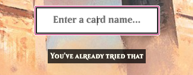

# Welcome to MTGdle

### A wordle-like, based on Magic the Gathering

## Description

For those who haven't played wordle, the game is about guessing a Magic the Gathering card based on it's attributes. Entering a card name will reveal the keywords, mana value, color, etc.. and reveal what aspects of the chosen card are matching or related to the hidden card. Of course, not all cards are in the game, I've chosen simple and iconic cards that many Magic players would know, with more to come in the future. A card index menu is present to help the player know what cards are valid guesses

### MTGDLE DEVELOPMENT IS CURRENTLY ON HOLD

MTGdle is a class project, but I hope to return to this game and implement much more of my icebox features. It is likely that the game will be rereleased as a 2.0 version so I can rework all of the systems from scratch.

## Current Game Features

### Attributes Being Compared
_Not including name_

* Colors
* CMC _Mana value_
* Types
* Legendary _yes/no_
* Original set release _with date_
* Textbox keywords and card effects

_These values may change in the future based on feedback_

## Game Screenshots

### Main menu screen

In the initial version of the game, the menu is very simple, with an input field and legend showing the box indicators.

### Winning card

The initial winning/losing box is simple at the moment, but I hope to add reference links to sites like Scryfall and TCGplayer for more card information and price.

### Card index

Since there isn't an autocomplete menu when typing, a card index is present to help players know what cards are in the game and to help those who may not be aware of some cards.

### Error messages

An error will appear if the name entered is not in the card library or was already guessed.

# Technologies Used

# Getting Started

[Current Stable Version](https://vsoups.github.io/MTGdle/)

1. Click the link
2. Enter a card name _(use index to check valid cards)_
3. Check the matching attributes
4. Continue until you win or lose
5. Click new game to try again

When matching attributes, remember that a yellow box is a partial match. Unfortunately a highlight feature hasn't been added yet to show what specific text was correct, but that should come in a future update. If you're ever lost or need help, the card index is available to preview of each card. Resouces like Scryfall or Gatherer are an amazing tool as well that I hope to impliment in the future to display card details.

# Future Plans

With the limited amount of traits being compared, the game is more difficult than I intended it to be in current state, but I hope to add more characteristics to compare.

* **FORMAT LEGALITY**: One of the biggest categories I wanted to add was format legality to show where the card is played and whether or not it's banned in any formats. My wireframe shows a basic view of how this will look once it's implemented. 

* **SET ORIGIN ARROWS**: One feature I missed was adding an arrow or other indicator on the set origin category. This would show whether the guessed card was release before, after or in the same year.

* **SUGGESTION BOX**: The suggestion box is a big feature I plan to add. The card index is helpful, but in it's current state, spelling errors will immediately reject the submission. A game that inspired me to create this, [Pokedle](https://www.pokedle.com/), does an amazing job with this. The preview art images are already in the system, so the suggestion section just needs to be coded.

* **HINT MENU**: Adding a hint after X amount of guesses would be another quality of life feature to add. The hints are already available for the original 6 test cards, so a new counter could be made to display those in a new section.

* **CARD LINKS**: In the final win/loss screen, I want to add links to Scryfall _(card database site)_, TCGplayer _(card marketplace)_, and something like MTGGoldfish _(deck listings)_ for players to find decks using the card.

* **EASY MODE**: Since the game is difficult with limited attributes to compare, an easy mode would allow more leniency. I would like this to be a toggle function that allows the player to choose before the game starts and after every game.

* **GUESS COUNT OPTION**: As an alternative to only having a set number or an endless amount of guesses, I want to allow the player to choose their own maximum.

* **COMPLEX CARDS**: I wanted to add planeswalkers, double sided, and other complex cards, but the amount of mechanics on them, and popularity kept me from adding them to the base version of the game. In time, I hope to eventually add enough specificity in each category that a player could reasonable guess the mystery card. This is definitely a long term goal, since multiple categories and system overhauls would need to be done in order to add these into the game.

# Reference Links

* **[Beleren Font](https://github.com/Saeris/typeface-beleren-bold/tree/master)**:
Huge thanks to Saeris for creating the font used for game. Google fonts didn't have anything close to this style, so having something nearly identical to the original card text is amazing.

<!-- * **[Scryfall](https://scryfall.com/)**:
Thank you to Scryfall for providing high quality images of the official cards. I use the site almost daily for my own personal use to find almost all of the information I need on my cards, so being able to use this for a personal project was a great experience. -->